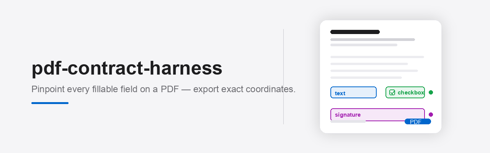
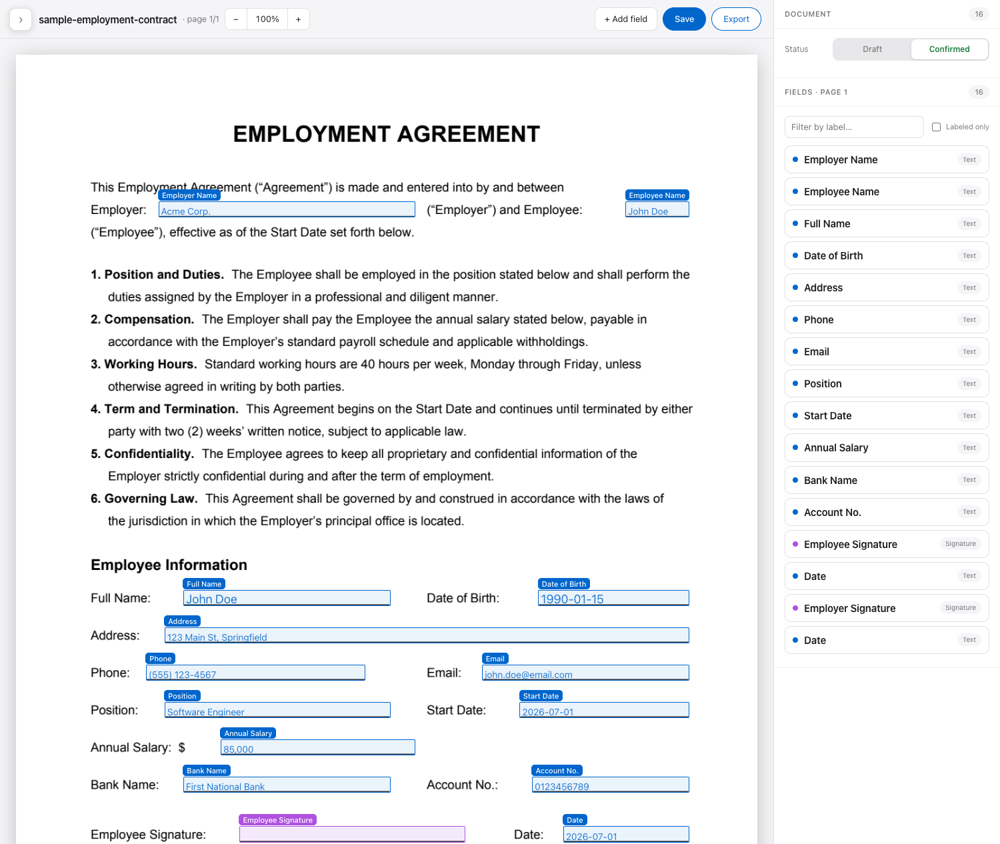
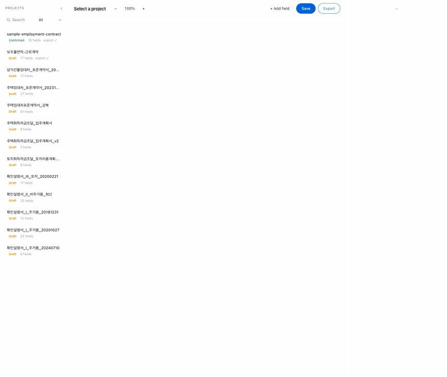

<div align="center">



<h1>pdf-contract-harness</h1>

**Pinpoint every fillable field on a PDF contract — then export exact coordinates.**

Deterministic geometry for the *positions*. Claude for the *meaning*. You for the *final say*.

[](https://www.python.org/)
[](https://fastapi.tiangolo.com/)
[](LICENSE)
[](#-contributing)

<br>


<sub>Claude reads the page → fields drop into place → right-click any field to copy its exact location → point &amp; say <i>"fix this"</i> → it snaps tight → export. <a href="docs/hero.mp4">▶ watch in HD</a></sub>

</div>

---

## Why this exists

Ask an LLM *"where are the blanks in this PDF?"* and it will confidently hand you coordinates that are **wrong**. Field positions get hallucinated. The contract gets filled in the wrong place.

The fix is to stop guessing. **Coordinates come from the PDF's own vector geometry — never from a model.**

> Real diagnosis from a sample contract: the underlines along the bottom fields were **68 vector PATH objects**, completely invisible to text extraction. The only `_` characters were 15 blanks up top. So we read underlines from **vector paths** and labels from **char boxes** — deterministically.

That split is the whole idea:

| Job | Who does it | How |
| --- | --- | --- |
| **Where** is each field (coordinates) | Geometry engine | Vector paths + char boxes — deterministic, exact |
| **What** each field means (label, hint, type) | Claude | Semantic labeling only, never coordinates |
| **Final confirmation** | You | Drag / resize / add / delete on a rendered overlay |

The result is a precise-coordinate `export.json` that *another* program (or another project's Claude) can read to fill the contract for real — landing every value exactly on its blank.

<div align="center">

<br><sub><b>Proof:</b> values placed purely from exported coordinates — every one lands on its line.</sub>
</div>

---

## ✨ Features

- 🎯 **Coordinate-accurate by construction** — positions extracted from vector geometry, not model guesses.
- 🧠 **Claude-assisted labeling** — file-based skills let Claude Code name fields and write fill hints, while coordinates stay frozen.
- 🖋️ **Visual correction studio** — Apple-clean web UI: drag, resize (4 handles), marquee multi-select, add, delete, inline rename, undo/redo, cursor-anchored zoom.
- 🔄 **Live reload** — Claude edits a file in your terminal, the browser updates in ~2s. The filesystem *is* the bus.
- 📦 **Clean export** — `export.json` with `bbox_pt` + `bbox_norm` + `font_size` + `fill_hint`, mappable to any resolution.
- 🧩 **3 field types only** — `text` · `checkbox` · `signature`. Simple on purpose.
- 💻 **Works headless too** — every step is file-based; the web app is optional.

<div align="center">

<br><sub>The correction studio — render + overlay + field list.</sub>
<br><br>

<br><sub>The real app: pick a field, nudge its exact <code>X/Y/W/H</code>, flip to <b>Confirmed</b>, export.</sub>
</div>

---

## 🚀 Quickstart

> Requires **Python 3.14+**. Clone and run.

```bash
git clone https://github.com/choism4/pdf-contract-harness.git
cd pdf-contract-harness

# 1. virtualenv + deps
python3 -m venv .venv
source .venv/bin/activate            # Windows: .venv\Scripts\activate
pip install -r requirements.txt

# 2. launch the studio
uvicorn app.server:app --reload      # → http://127.0.0.1:8000
```

Open **http://127.0.0.1:8000** and you'll see the bundled `sample-employment-contract` already loaded. Drag a box, rename a field, hit **Export** — done.

---

## 📐 How it works

```
   Claude Code  ⇄  [ projects/<subject>/ files ]  ⇄  Web app  ⇄  You
     (brain)            (single source of truth)      (visual UI)
```

- **The filesystem is the single source of truth and the message bus.** Every bit of state lives in `projects/<subject>/`.
- **The web app is a pure interface.** It renders the page, overlays boxes, saves your edits — and never calls an LLM. It watches `fields.json`'s mtime and live-reloads.
- **Claude Code is the brain.** Via two skills it extracts candidates and labels them — editing files directly, leaving coordinates untouched.

### The 4-step flow

```
1. Drop your PDF at   projects/<subject>/source.pdf
2. Extract            → candidate boxes + page render → fields.json
3. Label + correct    → Claude names fields; you fix positions visually
4. Export             → export.json (the confirmed, downstream-ready artifact)
```

### Try it on your own PDF

```bash
# 1. create a workspace and drop your file in (filename must be source.pdf)
mkdir -p projects/my-contract
cp /path/to/contract.pdf projects/my-contract/source.pdf

# 2. extract candidate fields + render + a verification overlay
.venv/bin/python .claude/skills/extract-pdf-fields/scripts/extract.py my-contract --overlay
```

This writes `page-0.png` (render), `page-0.overlay.png` (boxes drawn on top — **eyeball this**), and `fields.json` (candidates). Then open the web app to correct, or ask Claude Code to label.

---

## 🧩 Claude Code skills

If you use [Claude Code](https://claude.com/claude-code), this repo ships two skills it auto-discovers:

| Skill | What it does |
| --- | --- |
| **`extract-pdf-fields`** | Runs the geometry engine on a `source.pdf` → candidate `fields.json` + overlay. Verifies pixel accuracy. |
| **`label-pdf-fields`** | Reads each field's surrounding text and fills `label` / `fill_hint` / `type` — **never touching `bbox_*`**. |

Just tell Claude Code: *"extract the fields from `projects/my-contract`"*, then *"label them"*. The web app reflects every change live.

---

## 📤 Export schema

`export.json` is the contract you hand downstream. Coordinates are stored two ways so any consumer can map to any resolution.

```json
{
  "subject": "sample-employment-contract",
  "status": "confirmed",
  "pages": [
    { "index": 0, "size_pt": [595.28, 841.89],
      "render": { "file": "page-0.png", "scale": 2, "size_px": [1191, 1684] } }
  ],
  "fields": [
    {
      "id": "f3",
      "page": 0,
      "type": "text",                       // text | checkbox | signature
      "label": "Full Name",
      "fill_hint": "Employee full legal name",
      "example": "John Doe",
      "font_size": 9.8,
      "bbox_pt":   [134.3, 429.7, 300.68, 442.67],   // top-left origin, PDF points
      "bbox_norm": [0.2256, 0.5104, 0.5051, 0.5258], // 0..1, resolution-independent
      "source": "vector"
    }
  ]
}
```

**Coordinate rules** (the non-negotiables):

- Storage standard is **top-left origin, PDF points** (`bbox_pt`) **+ normalized 0..1** (`bbox_norm`).
- pdfium returns bottom-left origin → the engine converts: `y_top = page_height_pt - y_pdfium`.
- A field's box is the **rectangle text goes into** — the detected underline sits at the box's floor.

---

## 🗂️ Project layout

```
pdf-contract-harness/
├─ app/
│  ├─ server.py          # FastAPI: scan / read / save / export (no LLM calls)
│  ├─ export.py          # build export.json  (python -m app.export <subject>)
│  └─ static/index.html  # single-file correction studio
├─ .claude/skills/
│  ├─ extract-pdf-fields/  # deterministic geometry engine
│  └─ label-pdf-fields/    # Claude semantic labeling workflow
├─ projects/
│  └─ sample-employment-contract/   # bundled demo — open it on first run
├─ motion/               # Remotion source for the hero animation (npm run render)
└─ requirements.txt
```

Convention: input file is **always** `source.pdf`; the folder name is the contract's identifier.

---

## 🛣️ Roadmap

- [x] Vector-underline + underscore extraction with Korean char-box label recovery
- [x] Web correction studio (drag / resize / multi-select / zoom / undo)
- [x] Claude labeling skills + live reload
- [x] Coordinate-accurate export
- [ ] Checkbox / table-cell / signature auto-detection
- [ ] Scanned-PDF OCR (Tesseract `kor`+`eng`)

---

## 🤝 Contributing

PRs welcome. Good first issues: checkbox detection, table-cell forms, scanned-PDF OCR, more language samples. Keep the core rule sacred — **coordinates are extracted, never guessed.**

## 📄 License

[MIT](LICENSE) © Jaden Choi
